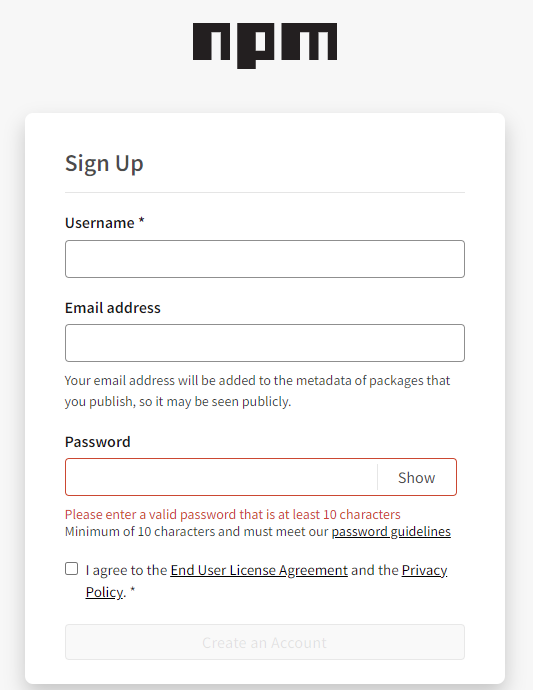
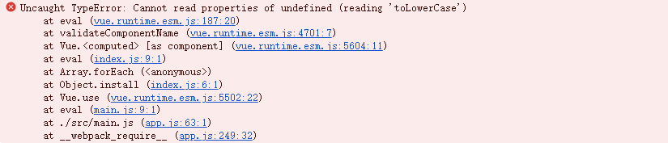
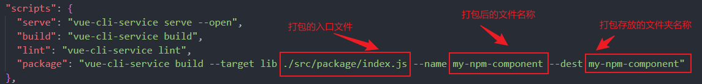
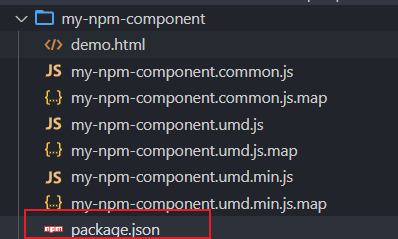
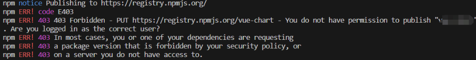
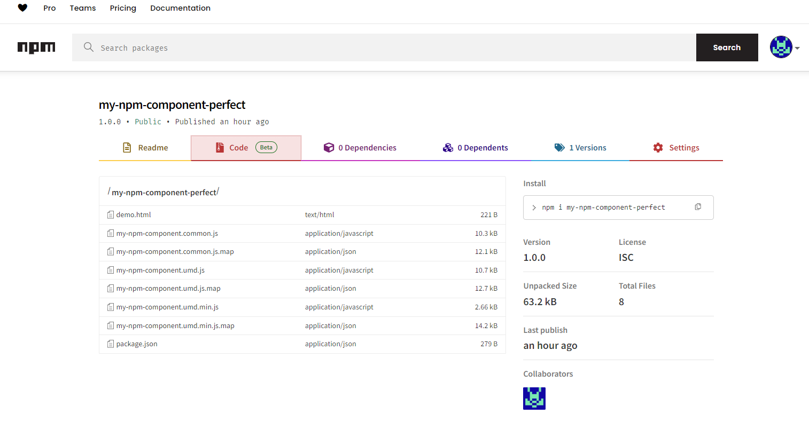

## 一、注册npm账户

进入npm官网注册账号
官网地址： https://www.npmjs.com/



## 二、编写组件

### 1、创建Vue项目

```git
npm install @vue/cli -g // 若没有安装脚手架请先安装
vue -v // 查看是否安装成功
vue create XXX  （项目名字） // 创建项目
```

### 2、组件封装

1. 在 src 目录下新建一个 package 文件夹，用来存放所有需要上传的组件。
2. 在上面新建好的 package 文件夹目录下新建 index.js 入口文件，存放批量注册组件的相关代码，

***可编写多个组件，在注册组件的代码中会将package目录下的所有后缀为.vue的文件引入并注册***

注册组件代码如下：

```vue
const requireComponent = require.context('./', true, /\.vue$/)
// 批量注册组件
const install = function (Vue) {
    if (install.installed) return
    install.installed
    requireComponent.keys().forEach(element => {
        const config = requireComponent(element)
        const componentName = config.default.name
        Vue.component(componentName, config.default || config)
    })
}

// 环境监测 确保是vue环境
if (typeof window !== 'undefined' && window.Vue) {
    install(window.Vue)
}

export default {
    install
} // 这个方法以后再使用的时候可以被use调用
```

​	3.编写组件

在package目录下新建组件文件
***注意：组件的name值为组件使用时的名称***

```vue
<template>
  <div>组件内容</div>
</template>
<script>
export default {
  name: 'MyComponent',
 }
</script>
```

*由于组件注册时将组件中的name值作为组件名称，所以组件中必须写name值，否则会报错如下*



​	4.测试组件，可以引用到 App.vue 组件里面验证组件是否可用

首先在main.js中引入package下的index文件，并注册

```vue
import Vue from 'vue'
import App from './App.vue'

import MyNpmComponent from './package/index.js'
Vue.use(MyNpmComponent);

new Vue({
  render: h => h(App),
}).$mount('#app')
```

使用组件

```vue
<template>
	<MyComponent/>
</template>
```

## 三、打包项目

1. 在整个项目根目录下的 package.json 文件的 scripts 配置项中，配置打包命令

   –target: 构建目标
   –name: 输出文件名
   –dest : 输出目录，默认 dist。

```json
 "scripts": {
    "serve": "vue-cli-service serve --open",
    "build": "vue-cli-service build",
    "lint": "vue-cli-service lint",
    "package": "vue-cli-service build --target lib ./src/package/index.js --name my-npm-component --dest my-npm-component"
  }
```



​	2.根目录下执行打包命令

```git
npm run package
```

## 四、发布组件

1.初始化packages.json文件
进入到打包后的组件目录中，执行命令

``` git
npm init -y
```

执行命令后会生成packages.json文件



2.配置packages.json文件
***name为组件名称，不可与npm已发布的组件重复***
***version为组件版本，不可与已发布的版本重复***

```json
{
  "name": "my-npm-component-perfect",
  "version": "1.0.0",
  "description": "The is my npm component",
  "main": "my-npm-component.common.js",
  "scripts": {
    "test": "echo \"Error: no test specified\" && exit 1"
  },
  "keywords": [],
  "author": "",
  "license": "ISC",
  "dependencies": {
    "my-npm-component-perfect": "^1.0.0"
  }
}
```

3.登录npm账户
输入登录信息和邮箱验证后即可登录成功

``` git
npm login
```

4.将npm 源地址修改为官方源
查看当前[npm镜像](https://so.csdn.net/so/search?q=npm镜像&spm=1001.2101.3001.7020)源

```git
npm get registry
```

修改 npm 源地址为官方源

```git
npm config set registry https://registry.npmjs.org/
```

5.发布到npm仓库
进入到打包后的组件目录中，执行发布命令

```git
npm publish
```

*注意：如果报错没有权限发布组件，可以在npm官网搜索一下需要发布的组件名称，组件名称不能与已发布的重名，重新修改一下组件名称即可*



6.查看组件是否发布成功
可在npm官网搜索发布的组件名称确认是否发布成功
查看组件是否同步到淘宝镜像源，可在淘宝源网站中搜索组件名称。如果不能及时同步，可以在包页面中点击“进行同步”按钮等待同步完成

[npm官网地址](https://www.npmjs.com/) [淘宝源地址](https://npm.taobao.org/)

发布成功!



## 五、在项目中使用发布的组件

1.新建项目

```git
vue create XXX  （项目名字）
```

2.安装组件
*my-npm-component-perfectt为发布的组件名称*

```git
npm install my-npm-component-perfectt
```

修改npm镜像源为淘宝镜像

```git
npm config set registry https://registry.npmmirror.com/
```

3.全局注册组件
**main.js中引入组件，并注册**
*my-npm-component-perfectt为引入组件名称可自定义*
*组件中如果有css样式文件，需要引入*

```vue
import Vue from 'vue'
import App from './App.vue'
import MyNpmComponent from 'my-npm-component-perfectt'
Vue.use(MyNpmComponent)

new Vue({
  render: h => h(App),
}).$mount('#app')
```

4.使用组件
全局注册后可直接使用组件
*MyComponent为编写组件时的name值*

```vue
<template>
  <div id="app">
     <MyComponent></MyComponent>
  </div>
</template>
```

## 六、Tips

my-npm-component-perfectt：发布项目的名称

my-npm-component：文件夹和生成文件的名称

MyComponent：组件的名称